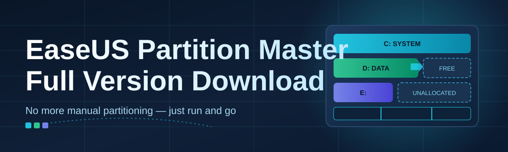

# partition-master-manager 💽⚡

  

*A disk management companion built around the EaseUS Partition Master full version download experience — resize, merge, and reorganize partitions without touching a command line.*

  

## 🧭 Overview

Disks don't grow with your needs — they just sit there, rigidly partitioned the day Windows was installed, until one volume is starving for space while its neighbor sits half-empty. Most people discover this the hard way: a system drive throwing "low disk space" warnings during an update, or a secondary drive locked into a layout that made sense three laptops ago. Manual partitioning tools that ship with Windows solve maybe a third of these problems and leave the rest to guesswork.

`partition-master-manager` exists as a curated landing hub for the EaseUS Partition Master full version download — the tool people reach for when they want partition resizing, cloning, and conversion handled by something purpose-built instead of stitched together from Disk Management and hope. This repository documents the workflow, the requirements, and the exact steps to get the application running, so anyone landing here from a search for "EaseUS Partition Master full version download" gets a clear, no-nonsense path instead of a maze of ad-laden mirrors.

It's built for a wide range of users: home users trying to reclaim space from an oversized recovery partition, IT technicians provisioning new machines, and enthusiasts migrating from HDD to SSD without a full reinstall. Whether you're resizing a single volume or restructuring an entire multi-disk layout, this project's docs and landing page are the starting point.

---

## 🗂️ What It Actually Does

| Capability | Fresh Take |
|---|---|
| **Resize & Move Partitions** | Drag a slider instead of doing disk-sector math in your head — space moves like liquid between volumes. |
| **Merge Volumes** | Two half-full partitions become one properly-sized drive, without a wipe-and-restore cycle. |
| **Clone Disk to Disk** | Mirrors an entire drive — OS, partitions, boot flags — onto a new disk, ideal for HDD-to-SSD swaps. |
| **Convert MBR ↔ GPT** | Switches partition table styles without the usual "delete everything and start over" tax. |
| **Recover Lost Partitions** | Scans for orphaned partition entries and rebuilds the table pointer without touching file contents. |
| **Format & Wipe** | Securely blanks a volume with selectable pass counts for compliance-minded users. |
| **File System Conversion** | Moves a volume between NTFS, FAT32, and exFAT while preserving directory structure. |
| **4K Alignment Check** | Flags misaligned partitions that quietly throttle SSD performance. |

> [!TIP]
> If you're only trying to shrink the recovery partition Windows created during setup, the **Resize & Move** capability alone will solve 90% of your reason for being here.

---

## 🚀 Getting Started

> [!NOTE]
> This is a standalone Windows application. There's no package manager step, no build process — just a landing page, a download, and a launch.

1. **Visit the landing page** using the download button above — it's the only distribution point referenced in this repository.

2. **Download the installer** for the current 2026 build.

3. **Run the installer** and follow the on-screen prompts — no extra runtimes required.

4. **Launch the app**, select your target disk from the left panel, and begin resizing, merging, or converting.

---

## 🖥️ System Requirements

| Component | Minimum | Recommended |
|---|---|---|
| **OS** | Windows 10 (64-bit) | Windows 11 (64-bit) |
| **RAM** | 2 GB | 4 GB or more |
| **Disk** | 100 MB free (install) | 500 MB free (operations buffer) |
| **CPU** | 1 GHz dual-core | 2 GHz quad-core |
| **Display** | 1024×768 | 1920×1080 |

> [!IMPORTANT]
> Always back up critical data before resizing or converting live system partitions. Partition operations are generally safe, but sudden power loss mid-operation is the one scenario no software can fully protect against.

---

## ⚙️ How It Works

The application follows a predictable pipeline every time it touches a disk:

1. **Scan** — enumerates all connected disks and reads their existing partition tables.

2. **Plan** — you define the target layout (resize, merge, convert) in a preview pane before anything is written.

3. **Validate** — the tool checks for file-system consistency and blocks operations that would corrupt data.

4. **Execute** — changes are committed, often via a pending-operations queue that runs before Windows fully boots for system-drive changes.

5. **Verify** — a post-operation check confirms the new partition table matches the plan.

---

## 🛠️ Troubleshooting

<strong>The resize operation is stuck at 0% — is it frozen?</strong>

Large NTFS volumes with heavy fragmentation take longer to index before the progress bar moves. Give it several minutes before assuming it's hung.

<strong>Why does my system need a restart to resize the C: drive?</strong>

System partitions are locked while Windows is running, so operations on them are queued and applied in a pre-boot environment during restart.

<strong>I converted MBR to GPT but the disk won't boot.</strong>

Check that your BIOS/UEFI boot mode matches the new partition style — GPT disks generally require UEFI boot mode enabled in firmware settings.

<strong>Can I cancel an operation halfway through?</strong>

Yes, but only before the "Execute" phase begins. Once a queued operation starts writing to disk, interrupting it risks partial writes.

<strong>Cloning finished, but the new disk shows less usable space.</strong>

Some capacity difference between drives (especially different manufacturers) is normal. Use the resize tool afterward to reclaim any leftover unallocated space.

---

## 🎨 Interface, Shortcuts & Themes

The interface favors a single-window layout: disk map on top, action panel below, log pane collapsible on the side.

| Shortcut | Action |
|---|---|
| `Ctrl+N` | New operation plan |
| `Ctrl+Z` | Undo last pending change (pre-execute only) |
| `F5` | Refresh disk scan |
| `Ctrl+Shift+L` | Open operation log |
| `Alt+T` | Toggle light/dark theme |

> [!TIP]
> Dark theme is easier on the eyes during long overnight clone jobs — toggle it from Settings → Appearance, or just hit `Alt+T`.

Settings persist per-user, including preferred units (MB/GB/percentage), default file system for new volumes, and whether pending operations require an extra confirmation dialog.

---

## 🤝 Contributing & Community

> [!WARNING]
> This repository is documentation and distribution-focused. Please don't submit binaries or altered installers as pull requests — stick to docs, translations, and landing-page improvements.

Contributions are welcome in the form of:

- Documentation clarity fixes and translations

- Landing page accessibility improvements

- Issue reports with clear repro steps (OS version, disk type, operation attempted)

Open an issue before submitting a large pull request so the change can be discussed first.

  

---

## 📄 License

Released under the [MIT License](LICENSE), 2026.

---

## ⚠️ Disclaimer

> This repository provides documentation and a landing-page link for the EaseUS Partition Master full version download. It is not affiliated with, endorsed by, or officially connected to EaseUS. All trademarks belong to their respective owners. Always evaluate software from official channels and back up important data before performing any disk-level operation.

